# Day00_インストール

---

## 🎯 目次
- [🎯 目次](#-目次)
- [📝 インストール手順](#-インストール手順)
  - [1. MS SQL Server ExpressとSSMSをダウンロードしてインストールします。](#1-ms-sql-server-expressとssmsをダウンロードしてインストールします)
  - [2. Windowsを再起動](#2-windowsを再起動)
  - [3. SSMSを起動して、SQL Serverに接続します。](#3-ssmsを起動してsql-serverに接続します)
  - [4. devdbというデータベースを作成します。](#4-devdbというデータベースを作成します)
  - [5. devuserというユーザーを作成し、devdbに接続できるようにします。](#5-devuserというユーザーを作成しdevdbに接続できるようにします)
  - [6. devuserでdevdbに接続できるか確認します。](#6-devuserでdevdbに接続できるか確認します)
- [✅ 振り返りチェック](#-振り返りチェック)
---

---

## 📝 インストール手順
## 1. MS SQL Server ExpressとSSMSをダウンロードしてインストールします。 
   - Expressは評価版であり、無料で使用できるバージョンです。  
      https://www.microsoft.com/ja-jp/sql-server/sql-server-downloads  
      ここから、SQL Server 2022 Expressをダウンロードして、インストールしてください。
      - インストール時「基本」を選択し、必要なコンポーネントをインストールします。
      - インストールウイザードの最後の画面から、「SSMSのインストール」ボタンを押下して、
        SQL Server Management Studio (SSMS) をインストールしてください。
        SSMSは、SQL Serverの管理ツールで、データベースの操作やクエリの実行ができます。
        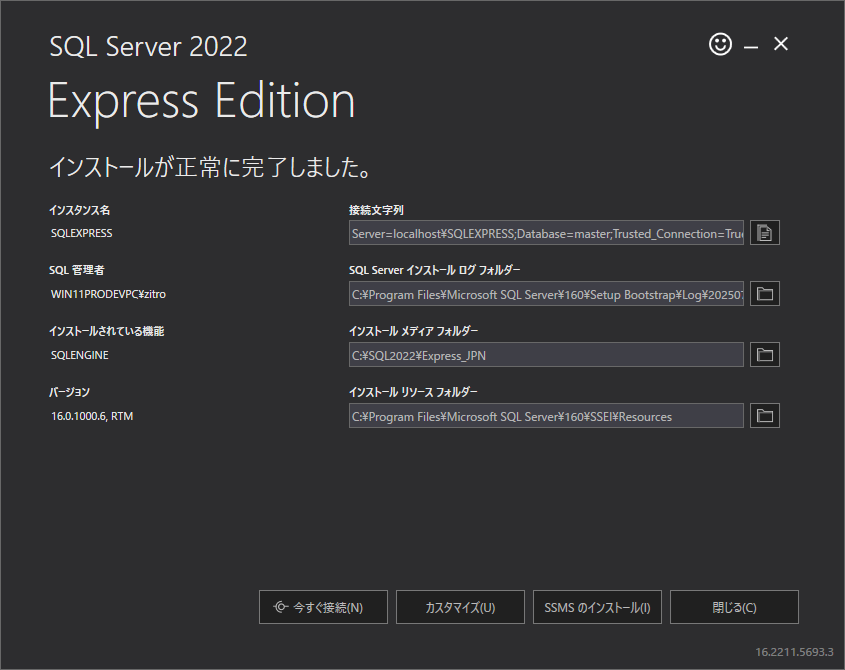
         ※管理者はインストールした環境ごとに異なります。
         リンクから辿ることができない場合は次のリンクをたどってください。
         https://learn.microsoft.com/ja-jp/ssms/install/install
         こちらから、「SSMS 21 のダウンロード」をクリックしてダウンロードしてください。
         まずは、MS SQL Server Expressのインストーラ最後の画面から「閉じる」を選んで完了させてから、先ほどダウンロードした「vs_SSMS.exe」を実行してください。
         インストール途中でコードツールの選択画面が出ますので、すべて選択してインストールしてください。
         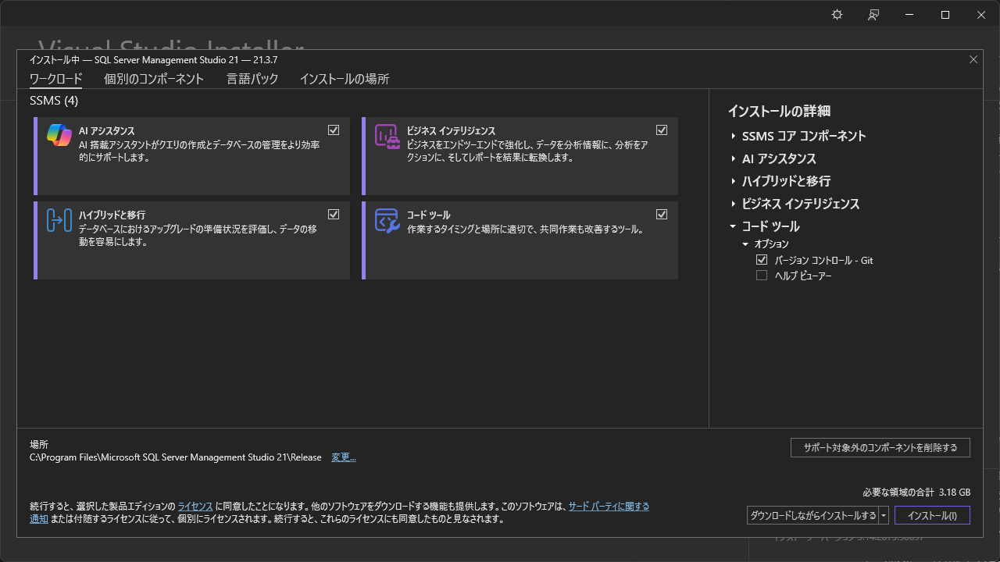
         VisualStuduioCommunityEditionをインストールしていた場合は、途中からVisualStuduioInstallerが起動し、VisualStuduioの更新なども出来ます。
## 2. Windowsを再起動
   - インストールが終わりましたら、一度Windowsの再起動をしてください（クリーンアップのため）
## 3. SSMSを起動して、SQL Serverに接続します。
   - SSMSを起動します。スタートメニューから「SMSS」と打ち込んで「SQL Server Management Studio」を起動してください。  
     最初の起動では、アカウント選択画面が表示されます。
     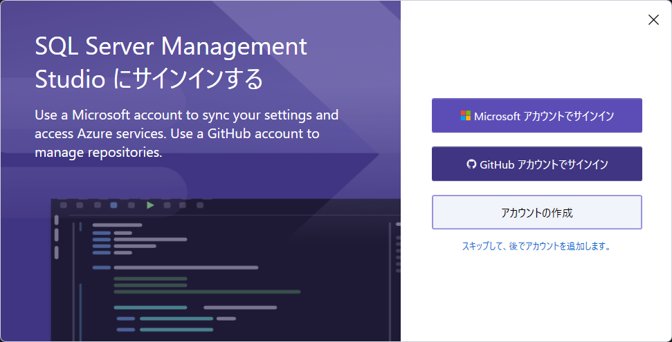
   - Microsoft アカウントでもよいのですが、ここではGitHubアカウントでログインを選びます。
      前もってGitHubアカウントを作り、手元のスマートフォンにGitHubアプリをインストールしておいてください。
      スマートフォンアプリを使った認証を行い、アカウントの紐づけが完了します。
   - 接続ダイアログの選択
     接続方式を新旧選べますので、ここでは「はい」を選択してください。
     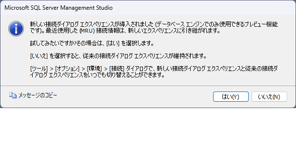

   - 接続情報の入力
      接続ダイアログが表示されますので、「参照」からSQLEXPRESSを選択してください。
      また、Encryptは「Optional」を選択し、TrustServerCertificateは「True」を選択してください。
     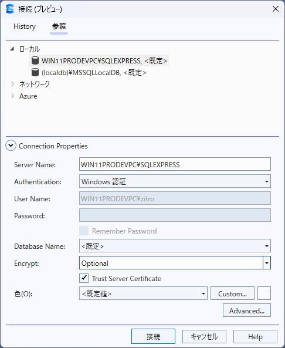
   - 接続が成功すると、SSMSのメイン画面が表示されます。
       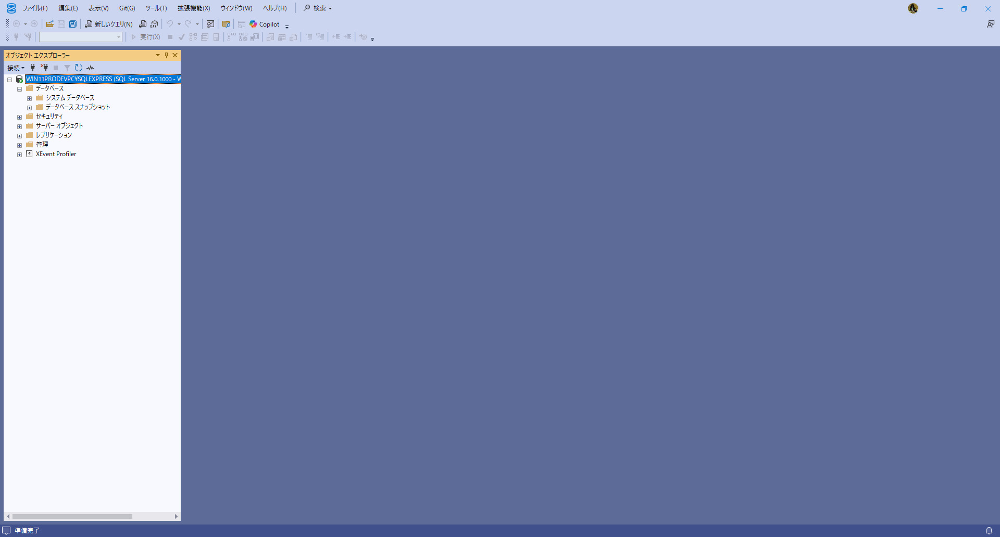

## 4. devdbというデータベースを作成します。
   - SSMSのメイン画面で、左側の「オブジェクトエクスプローラー」から「データベース」を右クリックし、「新しいデータベース」を選択します。
   - 「データベース名」に「devdb」と入力し、「OK」をクリックします。
   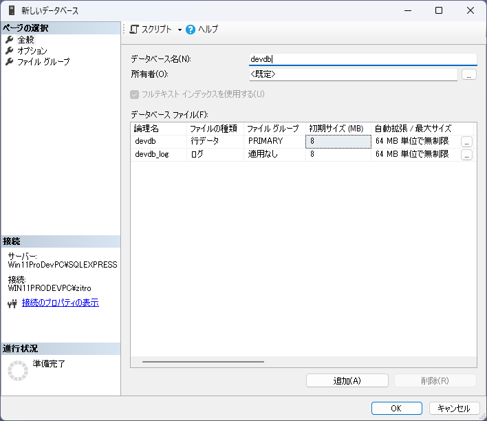
   - これで、devdbというデータベースが作成されました。
## 5. devuserというユーザーを作成します。
   - SSMSのメイン画面で、左側の「オブジェクトエクスプローラー」から「セキュリティ」を右クリックし、「新しいログイン」を選択します。
   - 「ログイン名」に「devuser」と入力し、「SQL Server認証」を選択します。
   - 「パスワード」に適当なパスワードを入力し、「確認のために再入力」を行います。
   - 「次回のログイン時にパスワードの変更を要求する」のチェックは外しておきます。
   - 「規定のデータベース」を「devdb」に設定してください。
   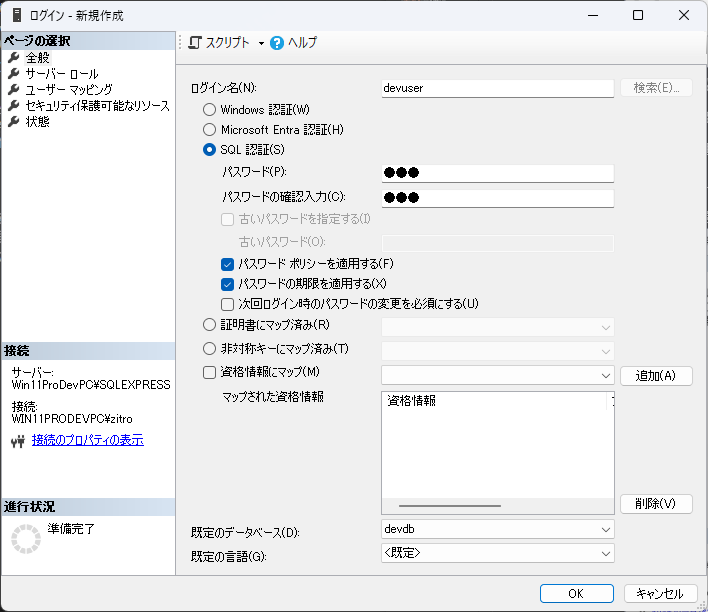
   - 「ユーザーマッピング」タブで「devdb」にチェックを入れ、「db_owner」ロールを選択します。
   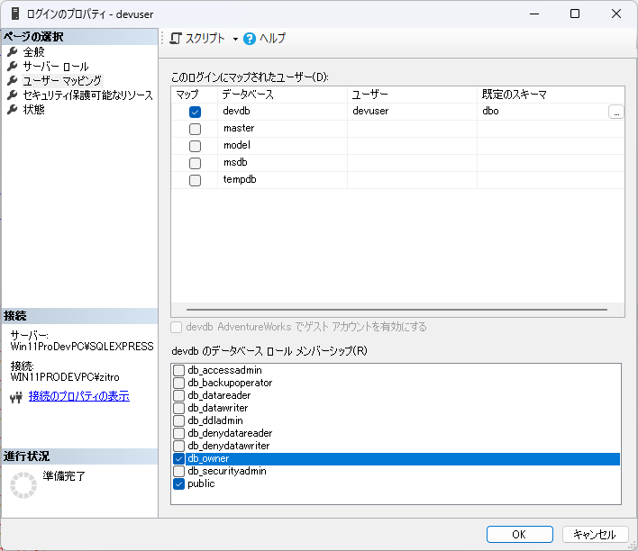
   - 「OK」をクリックして、devuserを作成します。
   - これで、devuserというユーザーが作成されました。
## 6. devdbでSQL Server認証を許可し、devdbに接続できるようにします。
   - オブジェクトエクスプローラーのサーバーを選択し、右クリックします。
   - プロパティを選択します。
   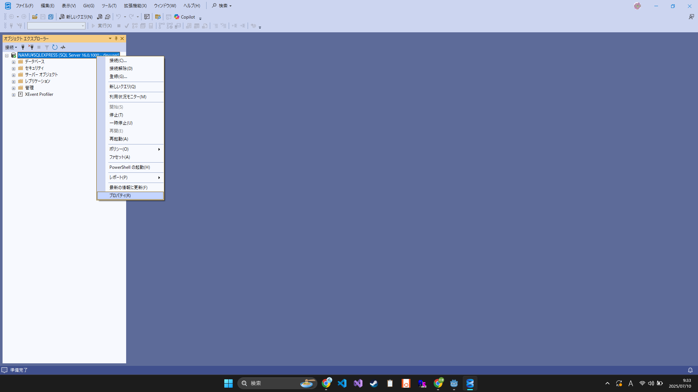
   - セキュリティのタブに移動し、「SQL Server認証モードとWindows認証モード(s)」を選択します
   - OKでウィンドウを閉じます
   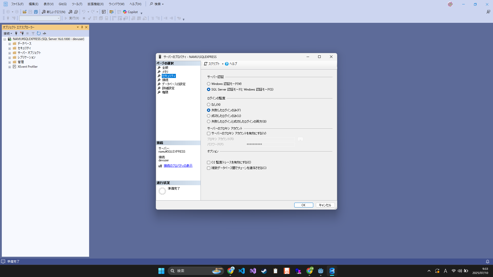
   - これでdevdbに接続できるようになりました。

## 7. devuserでdevdbに接続できるか確認します。
   - 一度オブジェクトエクスプローラーから接続を切断します。
   - SSMSのメイン画面で、左側の「オブジェクトエクスプローラー」から「接続」を右クリックし、「新しい接続」を選択します。
   - 「サーバー名」に「localhost\SQLEXPRESS」と入力し、「認証方式」を「SQL Server認証」に設定します。
   - 「ログイン名」に「devuser」、「パスワード」に先ほど設定したパスワードを入力し、「接続」をクリックします。
   - 接続が成功すると、devdbが表示されます。
---
## ✅ 振り返りチェック

- [ ] Express版などの種類があることを理解した
- [ ] Express版のインストール方法を理解した
- [ ] SSMSのインストール方法を理解した
- [ ] SSMSの起動方法を理解した
- [ ] devdbというデータベースを作成できた
- [ ] devuserというユーザーを作成し、devdbに接続できるようにした
- [ ] devuserでdevdbに接続できることを確認できた

---
