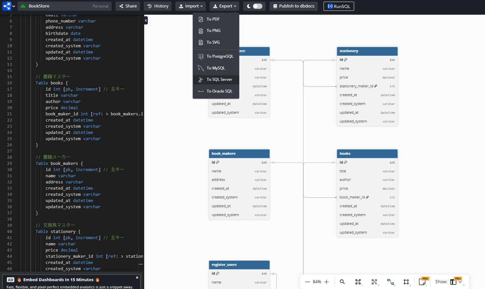
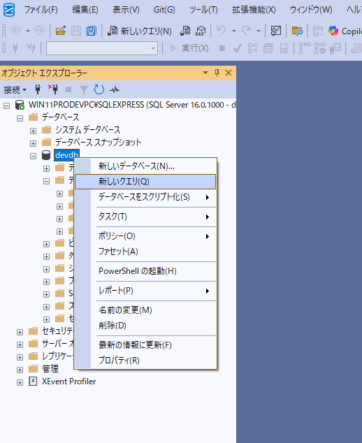
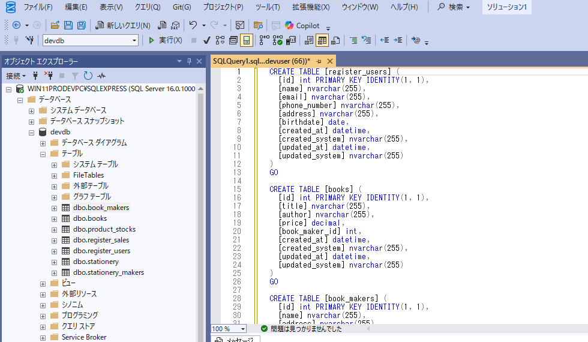

# Day1_RDBとER図

---

## 🎯 学習目標

- リレーショナルデータベース（RDB）とは？
- ER図とは？（dbdiagramの使い方を学ぶ）
- DSLからCREATE TABLE SQLに変換してSMSSでテーブルを作成する
- SMSSでINSERT文を使ってダミーデータを挿入する
- SMSSでDELETE文を使ってデータの削除とカウンターのリセットを行う

---

## 📘 内容概要

+ RDBの基本概念とER図の重要性を理解し、dbdiagramを使ってER図を作成する方法を学びます。
+ SSMSを使用してSQL Serverに接続し、ER図をSQLに変換してデータベースを作成する方法を学びます。
+ SQLのINSERT文を用いてダミーデータを挿入し、データベースの動作を確認します。
+ SQLのDELETE文を用いてデータの削除とカウンターのリセットを行う方法を学びます。

---

## 📝 内容詳細

1. リレーショナルデータベース（RDB）の基本概念
   - RDBは、データをテーブル形式で管理します。  
      リレーショナルとは、テーブル間の関係を指します
   - テーブルは、行（レコード）と列（フィールド）で構成されます。  
      例えば、表計算ソフトのシートのような形式です。
   - テーブルは行と列で構成され、各行はレコード、各列はフィールドを表します。（行の文字の横線２本から横方向が行、列の文字の縦棒２本から縦方向が列と覚えるとよいです）
   - テーブル間の関係（リレーション）を定義することで、テーブルの独立性を保ちながら、データの整合性を確保します。
   - RDBでは、SQL（Structured Query Language）を使用してデータの操作を行います。
   - SQLは、データの取得、挿入、更新、削除などの操作を行うための言語です。
   - RDBの特徴
     - データの整合性と一貫性を保つための制約を提供します。
     - データの冗長性を排除し、効率的なデータ管理を実現します。
     - データの検索や集計を効率的に行うことができます。
   - RDBの例：MySQL、PostgreSQL、Microsoft SQL Serverなど
   - テーブルには主キー（Primary Key）と外部キー（Foreign Key）があります。
     - 主キーは、テーブル内で一意のレコードを識別するためのフィールドです。
     - 外部キーは、他のテーブルの主キーを参照するフィールドで、テーブル間の関係を表します。
   - 例：顧客テーブルと注文テーブルがあり、注文テーブルの外部キーが顧客テーブルの主キーを参照することで、
     - 顧客とその注文の関係を表現します。
2. ER図とは
   - ER図（Entity-Relationship Diagram）は、データベースの設計を視覚的に表現するための図です。
   - エンティティ（Entity）とリレーションシップ（Relationship）を表現します。
   - エンティティは、データベース内のオブジェクトや概念を表します。
     - 例：顧客、注文、商品など
   - リレーションシップは、エンティティ間の関係を表します。
     - 例：顧客が注文を行う、注文に商品が含まれるなど
   - ER図は、データベースの構造を理解しやすくするために使用されます。
   - ER図の要素
     - エンティティ：四角形で表現され、エンティティ名が記載されます。
     - 属性：楕円形で表現され、エンティティの特性を表します。
     - リレーションシップ：菱形で表現され、エンティティ間の関係を示します。
     - 主キー：エンティティの属性の中で、一意に識別できる属性を示します。
     - 外部キー：他のエンティティの主キーを参照する属性を示します。
   - ER図の例
     - 顧客エンティティ（顧客ID、名前、メールアドレスなどの属性）
     - 注文エンティティ（注文ID、注文日、顧客IDなどの属性）
     - リレーションシップ（顧客が注文を行う）
3. dbdiagramの使い方
   - dbdiagramは、ER図を簡単に作成できるオンラインツールです。
   - dbdiagramの公式サイトにアクセスします。
     - [dbdiagram.io](https://dbdiagram.io/)
   - アカウントを作成するか、Githubなどのアカウントでログインしてください。
   - 新しいダイアグラムを作成します。
   - ER図を作成するためのDSL（Domain Specific Language）を使用します。
   - ここでは、文房具兼書店のデータベースを例に、dbdiagramの使い方を説明します。
   - dbdiagramのDSLは、テーブルの定義とリレーションシップを簡潔に記述できます。
   - テーブルの定義は、`Table`キーワードを使用して行います。
   - 各テーブルのフィールドは、データ型と制約を指定して定義します。
   - リレーションシップは、`[ref: >]`を使用して他のテーブルの主キーを参照します。
   - 例：文房具兼書店のデータベース
      ```dbml
      // レジ操作者
      Table register_users {
          id int [pk, increment] // 主キー
          name varchar
          email varchar
          phone_number varchar
          address varchar
          birthdate date
          created_at datetime
          created_system varchar
          updated_at datetime
          updated_system varchar
      }

      // 書籍マスター
      Table books {
          id int [pk, increment] // 主キー
          title varchar
          author varchar
          price decimal
          book_maker_id int [ref: > book_makers.id] // 書籍メーカーへの外部キー
          created_at datetime
          created_system varchar
          updated_at datetime
          updated_system varchar
      }

      // 書籍メーカー
      Table book_makers {
          id int [pk, increment] // 主キー
          name varchar
          address varchar
          created_at datetime
          created_system varchar
          updated_at datetime
          updated_system varchar
      }

      // 文房具マスター
      Table stationery {
          id int [pk, increment] // 主キー
          name varchar
          price decimal
          stationery_maker_id int [ref: > stationery_makers.id] // 文房具メーカーへの外部キー
          created_at datetime
          created_system varchar
          updated_at datetime
          updated_system varchar
      }
      // 文房具メーカー
      Table stationery_makers {
          id int [pk, increment] // 主キー
          name varchar
          address varchar
          created_at datetime
          created_system varchar
          updated_at datetime
          updated_system varchar
      }

      // 商品在庫
      Table product_stocks {
          id int [pk, increment] // 主キー
          book_id int [ref: > books.id] // 書籍への外部キー
          stationery_id int [ref: > stationery.id] // 文房具への外部キー
          quantity int
          created_at datetime
          created_system varchar
          updated_at datetime
          updated_system varchar
      }

      // レジ売上
      Table register_sales {
          id int [pk, increment] // 主キー
          register_user_id int [ref: > register_users.id] // レジ操作者への外部キー
          product_stock_id int [ref: > product_stocks.id] // 商品在庫への外部キー
          sale_date datetime
          sale_amount decimal
          created_at datetime
          created_system varchar
          updated_at datetime
          updated_system varchar
      }

     ```
   - 上記をdbdiagramのエディタに貼り付けて、ER図を生成します。
   - dbdiagramでは、ER図を視覚的に編集することもできます。
   - 作成したER図は、画像としてエクスポートしたり、SQLのDDL（Data Definition Language）としてエクスポートすることも可能です。
   - dbdiagramを使うことで、データベースの設計を効率的に行うことができます。
   - それではSQLをExportしてみましょう。
   - dbdiagramの画面右上にある「Export」ボタンをクリックして、SQLをエクスポートします。
   - エクスポート形式として「SQL Server」を選択します。
     
   - 注意していただきたい点は、今までTableの定義をしてきたDSLは、dbdiagramの独自の言語であり、SQLとは異なる点です。
   - dbdiagramのDSLは、ER図を簡単に作成するためのもので、SQLのDDLに変換するためのものです。
   - そのため、dbdiagramで作成したER図をSQL Serverに適用するためには、エクスポート機能を使用してSQLに変換する必要があります。
   - エクスポートされたSQLは、dbdiagramのDSLをSQL ServerのDDLに変換したものです。
   - このSQLを実行することで、dbdiagramで設計したデータベースの構造をSQL Server上に反映させることができます。

4. SQL ServerにSQLでER図を適用する
   - エクスポートされたSQLをメモ帳などで開き全体をコピーします。
   - SQL Server Management Studio (SSMS)を起動します。
   - SSMSでdevdbを右クリックして「新しいクエリ」を開きます。
     
   - 先ほどコピーしたSQLを貼り付けます。
     
   - SQLを実行します。
   - 文房具兼書店のデータベースがSQL Server上に作成されます。
   - SSMSのオブジェクトエクスプローラーで、作成したデータベースを確認できます。
   - 作成したテーブルやリレーションシップが正しく反映されていることを確認します。
   
   - 以上により、dbdiagramを使ってER図を作成し、
   - SQL Serverに適用する手順が完了しました。

5. ダミーデータを作成する
   - 作成したテーブルにダミーデータを挿入して、データベースの動作を確認します。
   - 以下のSQLを実行して、ダミーデータを挿入します。
   ```sql
   -- 書籍メーカー（先に必要）
   INSERT INTO book_makers (name, address, created_at, created_system, updated_at, updated_system)
   VALUES
   ('書籍出版株式会社', '東京都千代田区', GETDATE(), 'init', GETDATE(), 'init'),
   ('文芸社', '東京都渋谷区', GETDATE(), 'init', GETDATE(), 'init');

   -- 文房具メーカー（先に必要）
   INSERT INTO stationery_makers (name, address, created_at, created_system, updated_at, updated_system)
   VALUES
   ('文房具工業', '大阪市西区', GETDATE(), 'init', GETDATE(), 'init'),
   ('ペン工房', '名古屋市中区', GETDATE(), 'init', GETDATE(), 'init');

   -- 書籍（book_maker_idが必要）
   INSERT INTO books (title, author, price, book_maker_id, created_at, created_system, updated_at, updated_system)
   VALUES
   ('AIの未来', '山田 一郎', 1980.00, 1, GETDATE(), 'init', GETDATE(), 'init'),
   ('ロボットの歴史', '佐藤 二郎', 2500.00, 2, GETDATE(), 'init', GETDATE(), 'init');

   -- 文房具（stationery_maker_idが必要）
   INSERT INTO stationery (name, price, stationery_maker_id, created_at, created_system, updated_at, updated_system)
   VALUES
   ('高級ボールペン', 500.00, 1, GETDATE(), 'init', GETDATE(), 'init'),
   ('ノート A4', 300.00, 2, GETDATE(), 'init', GETDATE(), 'init');

   -- レジ操作者（register_sales の親）
   INSERT INTO register_users (name, email, phone_number, address, birthdate, created_at, created_system, updated_at, updated_system)
   VALUES
   ('田中 太郎', 'taro@example.com', '090-1234-5678', '東京都港区', '1990-01-01', GETDATE(), 'init', GETDATE(), 'init'),
   ('佐藤 花子', 'hanako@example.com', '080-9876-5432', '大阪市北区', '1985-07-20', GETDATE(), 'init', GETDATE(), 'init');

   -- 商品在庫（書籍・文房具の親IDを参照）
   INSERT INTO product_stocks (book_id, stationery_id, quantity, created_at, created_system, updated_at, updated_system)
   VALUES
   (1, NULL, 20, GETDATE(), 'init', GETDATE(), 'init'), -- 書籍1
   (2, NULL, 10, GETDATE(), 'init', GETDATE(), 'init'), -- 書籍2
   (NULL, 1, 50, GETDATE(), 'init', GETDATE(), 'init'), -- 文房具1
   (NULL, 2, 40, GETDATE(), 'init', GETDATE(), 'init'); -- 文房具2

   -- レジ売上（product_stocks と register_users を参照）
   INSERT INTO register_sales (register_user_id, product_stock_id, sale_date, sale_amount, created_at, created_system, updated_at, updated_system)
   VALUES
   (1, 1, '2025-07-01 10:00:00', 1980.00, GETDATE(), 'init', GETDATE(), 'init'), -- 書籍1を田中が売った
   (2, 3, '2025-07-02 11:30:00', 500.00, GETDATE(), 'init', GETDATE(), 'init');  -- 文房具1を花子が売った

   ```
   - 上記のSQLをSSMSで実行することで、ダミーデータが挿入されます。
   - ダミーデータを挿入した後、SSMSのオブジェクトエクスプローラーで、各テーブルのデータを確認できます。
   - 例えば、`register_users`テーブルのデータを確認するには、
   - オブジェクトエクスプローラーで`register_users`テーブルを右クリックし、「テーブルの内容を表示」を選択します。
   - これにより、ダミーデータが正しく挿入されていることを確認できます。
   - もし、上記SQLでエラーがでたり、一度データをリセットしたい場合は、以下のSQLでデータの削除とカウンターのリセットを行うことができます。
   ``` sql
      -- 1. レジ売上（最も下流）
      DELETE FROM register_sales;

      -- 2. 商品在庫（books, stationery の外部キーを持つ）
      DELETE FROM product_stocks;

      -- 3. 書籍・文房具（それぞれメーカーへの外部キーあり）
      DELETE FROM books;
      DELETE FROM stationery;

      -- 4. 書籍メーカー、文房具メーカー
      DELETE FROM book_makers;
      DELETE FROM stationery_makers;

      -- 5. レジ操作者
      DELETE FROM register_users;

      -- IDのカウンターをリセット（次のINSERTで1から再開するように）
      DBCC CHECKIDENT ('book_makers', RESEED, 0);
      DBCC CHECKIDENT ('stationery_makers', RESEED, 0);
      DBCC CHECKIDENT ('books', RESEED, 0);
      DBCC CHECKIDENT ('stationery', RESEED, 0);
      DBCC CHECKIDENT ('register_users', RESEED, 0);
      DBCC CHECKIDENT ('product_stocks', RESEED, 0);
      DBCC CHECKIDENT ('register_sales', RESEED, 0);
   ```


---

## ✅ 振り返りチェック

- [ ] リレーショナルデータベースの概念を理解した
- [ ] ER図の概念を理解した
- [ ] DSLを用いてdbdiagramの使い方を学んだ
- [ ] DSLとSQLの違いを理解できた
- [ ] ER図の見方が理解できた
- [ ] SSMSでSQLを実行できるようになった
- [ ] SSMSでテーブルを確認できるようになった
- [ ] SQLでダミーデータのInsertができるようになった
- [ ] SQLでデータの削除とカウンターのリセットを行うことができきるようになった

---
